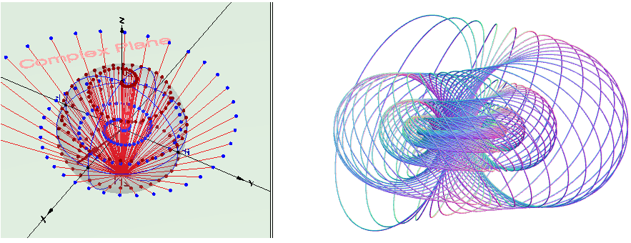

# Hopf-fibration-quantum-rotations
Hopf fibrations, Bloch sphere and quantum rotations

  <a href ="https://github.com/vlad0007/Hopf-fibration-quantum-rotations" target="_blank"> Hopf-fibration-quantum-rotations</a>

Video that shows how to work with the program is provided on this website
  <a href ="https://youtu.be/RH-sTfONevU" target="_blank">video</a>.

Screenshot of this program
 

